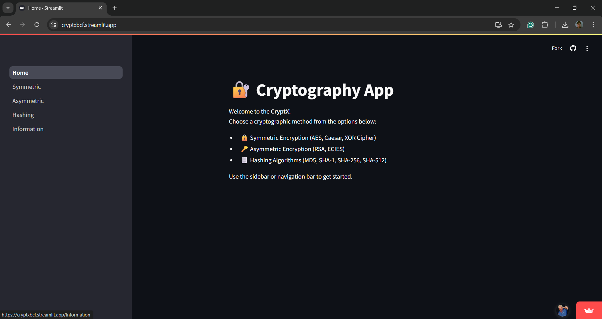
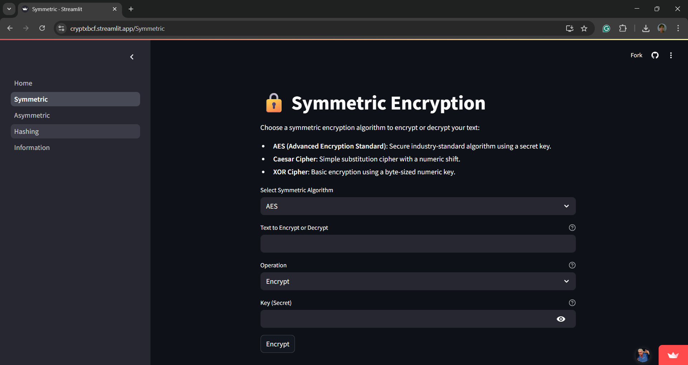
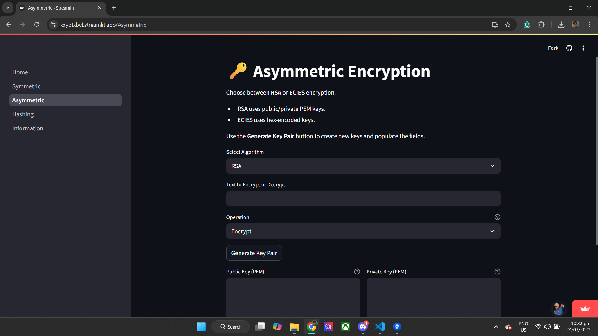
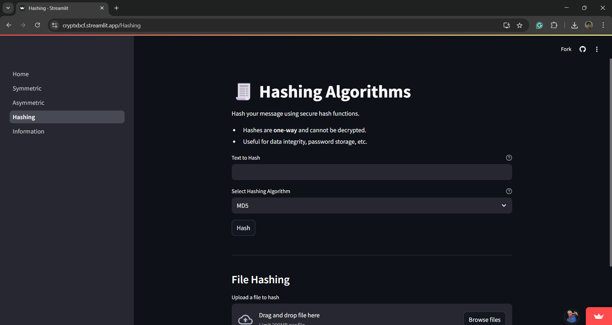

# FP_APPLIED_CRYPTOGRAPHY
 Cryptify
 Applied Cryptography Final Project

Course: CSAC 329  
Date: May 2025

 Group Members:
- Clores, Mark Angelo
- Fortuna, Ramelle Mhiro
- Peñales, Hanna Fiona

 Introduction:
Cryptify is a Flask-based cryptographic application that enables users to perform symmetric and asymmetric encryption/decryption and apply various hash algorithms to secure data.

 Objectives:
- Implement secure and reliable cryptographic techniques.
- Provide a user-friendly web interface for applying cryptographic operations.
- Educate users about cryptographic algorithms with descriptive information.

Discussion:

The Crypto Gadget tool, built with Streamlit, offers a hands-on, interactive experience for exploring key cryptographic techniques. With a clean and intuitive sidebar navigation, users can switch between symmetric encryption/decryption, key generation, and hashing functions. The application opens on Home.py, which welcomes users, provides usage instructions, and introduces the available cryptographic modes. Streamlit’s real-time capabilities make it easy to experiment with cryptographic processes while understanding their mechanics.

Each cryptographic feature in Crypto Gadget is designed with an educational objective. The hashing section demonstrates MD5, SHA-1, and SHA-256 algorithms to show how data integrity is verified. Symmetric encryption covers Fernet, AES (CBC mode), and ChaCha20, illustrating how passwords generate secret keys and the use of salt/IV. For asymmetric cryptography, the app supports RSA, DSA, and ECDSA key pair generation, essential for understanding public-key cryptography and digital signatures. Developed using Python’s cryptography and hashlib libraries, the tool runs in a GitHub Codespaces environment, powered by a configured devcontainer.json that includes all dependencies and sets up port forwarding for immediate browser access. This containerized setup ensures ease of replication, sharing, and collaboration, making Crypto Gadget both a practical tool and a structured learning platform for applied cryptography.

Sample Runs/Outputs:

The homepage of the website will host all of the tools that are available to use

If you chose Symmetric Encryption, it will prompt you to choose a algorithm and enter a text to encrypt or decrypt, will let you choose the operation if to encrypt or decrypt, then will let you enter the key you want then just press encrypt.

In the Assymetric encryption, it is almost the same to symmetric encryption but instead of a key, a public and private key would be asked.

In this page, you will just enter a text and it will simply hash it.
